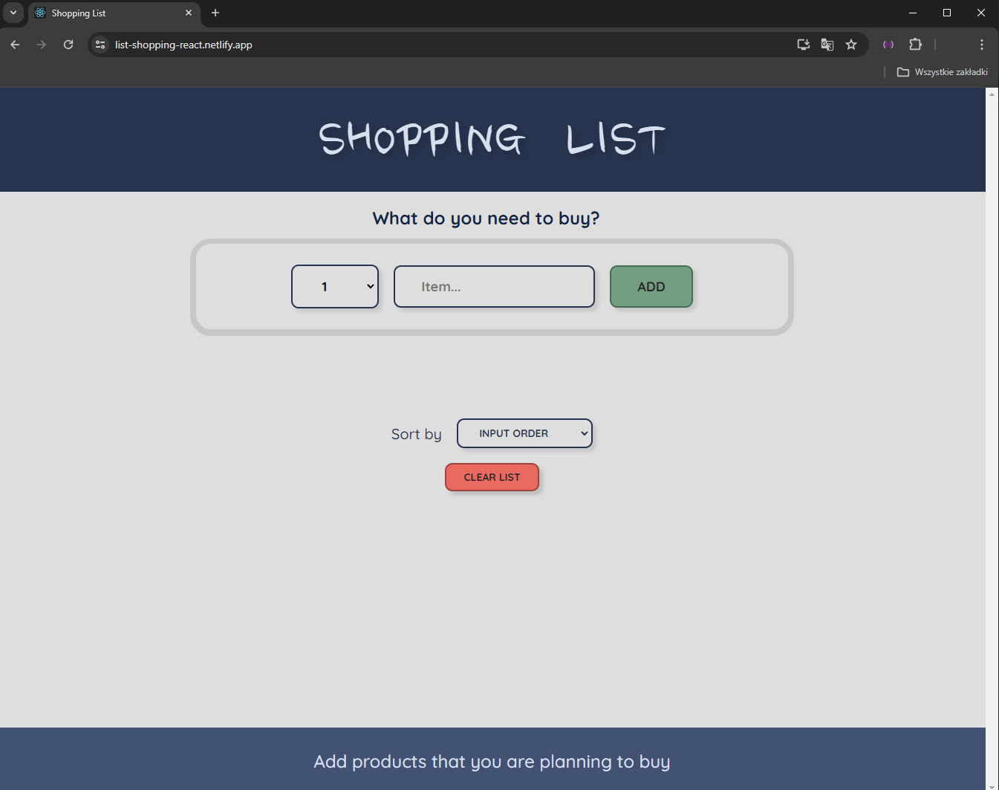
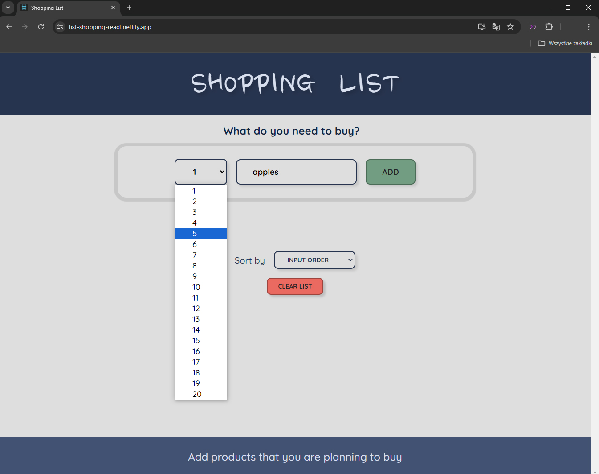
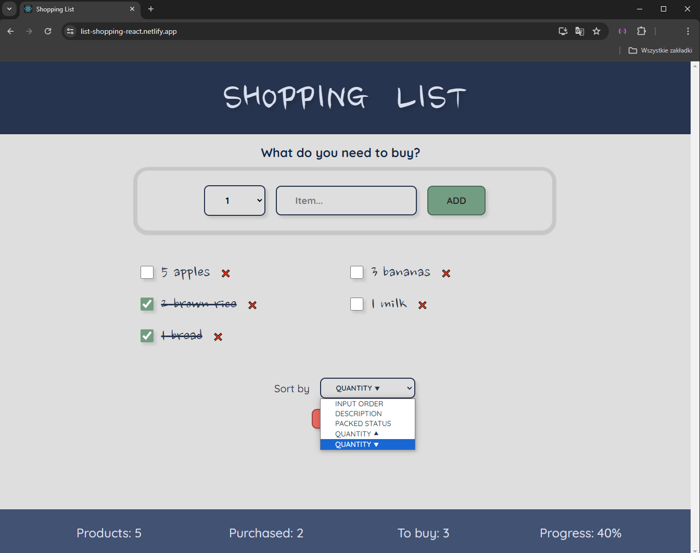

# Shopping List 

This React application is a simple packing list manager that allows users to add, delete, toggle, and sort items.
Link to the app: https://list-shopping-react.netlify.app/

## Key features and solutions:
- Functional components and hooks
- State management with `useState`
- Event handling for user interactions
- Conditional rendering for dynamic UI updates
- Dynamic lists with unique keys
- Reusable component composition
- User interaction through forms and lists
- Confirmation dialog for critical actions

## Usage
1. Add items to your packing list
2. Toggle item status between packed and unpacked
3. Sort items by different criteria
4. Delete individual items or clear the entire list

